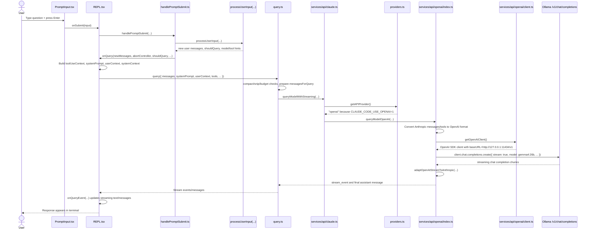

# Study: One Prompt Data Flow With Ollama/OpenAI-Compatible Provider

This note traces the interactive flow for this command:

```bash
CLAUDE_CODE_USE_OPENAI=1 \
OPENAI_BASE_URL=http://127.0.0.1:11434/v1 \
OPENAI_API_KEY=ollama \
OPENAI_MODEL=gemma4:26b \
bun run dev
```

Scope: user types one normal prompt in the terminal REPL and presses Enter. This is the interactive REPL path, not `-p` print mode, ACP, remote mode, or SDK mode. `QueryEngine` exists for SDK/ACP-style orchestration, but this REPL path calls `query(...)` directly from `REPL.tsx`.

## High-Level Sequence Diagram

VS Code's Markdown preview can render the Mermaid diagram below directly.



## Detailed Function-by-Function Trace

### 1. CLI Startup

1. `src/entrypoints/cli.tsx` starts in `main()` at lines 74-75. It checks fast paths such as `--version`, MCP modes, daemon worker, bridge mode, and other special commands.
2. For your command, no special CLI argument is present. The entrypoint reaches the normal CLI path at lines 392-399:
   - `startCapturingEarlyInput()` starts early input capture.
   - It dynamically imports `../main.jsx`.
   - It calls `cliMain()`.
3. `src/main.tsx` then builds the Commander CLI and eventually renders the interactive Ink application/REPL path. The large `main.tsx` file owns command registration, config, trust/MCP/hook startup, and decides between non-interactive print mode and interactive mode.

### 2. Prompt Input Captures Submit

1. `src/components/PromptInput/PromptInput.tsx` registers a `chat:submit` handler at lines 1959-1975.
2. That handler calls `onSubmit(input)` at lines 1971-1972.
3. In normal Enter submission, the component comments note that Enter is handled by the text input submit prop, while this handler supports chord/keybinding submission. Both paths ultimately call the REPL-provided `onSubmit`.

### 3. REPL `onSubmit(...)`

1. `src/screens/REPL.tsx` defines `onSubmit` at lines 3804-4240.
2. It first performs UI/session bookkeeping:
   - repins scroll at lines 3815-3817.
   - resumes proactive/Kairos mode if enabled at lines 3819-3822.
   - handles pipe routing at lines 3824-3843.
   - checks immediate slash commands at lines 3845-3983.
   - updates history and clears/restores input UI state at lines 4019-4097.
3. For a normal typed question, it reaches line 4193, waits for pending startup hooks, and calls `handlePromptSubmit(...)` at lines 4196-4225.

### 4. `handlePromptSubmit(...)` Normalizes the Submitted Input

1. `src/utils/handlePromptSubmit.ts` exports `handlePromptSubmit(...)` at lines 128-398.
2. It extracts parameters and helpers at lines 131-155.
3. It filters pasted image references at lines 187-196.
4. It returns early on empty input at lines 197-199.
5. It expands pasted text references at lines 222-225 and logs paste metadata at lines 226-234.
6. If a query is already active, it queues the input at lines 322-360. In the normal idle case, it continues.
7. It starts query profiling at lines 363-364.
8. It wraps the direct input in a `QueuedCommand` at lines 366-377 so direct input and queued input share the same execution path.
9. It calls `executeUserInput(...)` at lines 379-397.

### 5. `executeUserInput(...)` Converts Text Into Message Objects

1. `executeUserInput(...)` starts at `src/utils/handlePromptSubmit.ts` line 407.
2. It creates a fresh `AbortController` at lines 426-431 and exposes it to REPL state.
3. It reserves the `queryGuard` at line 448. This prevents a second prompt from starting another overlapping turn.
4. It iterates queued commands at lines 486-539.
5. For the first command, it calls `processUserInput(...)` at lines 493-513. This is where plain prompt text, slash commands, bash mode, attachments, IDE selection, and related prompt decorations become internal `Message` objects.
6. It stores returned `result.messages`, `result.shouldQuery`, allowed tools, model override, effort override, and possible chained input at lines 530-537.
7. If new messages exist, it resets local UI/tool JSX state at lines 558-568.
8. It calls REPL `onQuery(...)` at lines 577-588 with:
   - `newMessages`
   - `abortController`
   - `shouldQuery`
   - `allowedTools`
   - selected `mainLoopModel`
   - optional `onBeforeQuery`
   - primary input text
   - optional effort override

### 6. REPL Builds Query Context

1. `src/screens/REPL.tsx` defines `onQueryImpl(...)` at lines 3171-3430.
2. It performs per-turn startup work:
   - IDE query-start handling at lines 3181-3190.
   - onboarding completion at lines 3193-3194.
   - optional session title generation from the first real user message at lines 3196-3231.
   - slash-command-scoped allowed tool state at lines 3233-3261.
3. If `shouldQuery` is false, it resets loading state and returns at lines 3263-3280. For a normal question, `shouldQuery` is true.
4. It creates `toolUseContext` at lines 3282-3287.
5. It reads fresh tools and MCP clients from that context at lines 3288-3293.
6. It loads prompt context in parallel at lines 3306-3322:
   - `getSystemPrompt(...)`
   - `getUserContext()`
   - `getSystemContext()`
7. It builds the effective system prompt at lines 3336-3343.
8. It calls `query(...)` from `src/query.ts` at lines 3350-3358.
9. For each event yielded by `query(...)`, it calls `onQueryEvent(event)` at line 3359.

### 7. REPL Consumes Stream Events

1. `onQueryEvent(...)` is defined in `src/screens/REPL.tsx` at lines 3040-3169.
2. It calls `handleMessageFromStream(...)` at lines 3042-3166.
3. When a new complete message arrives, it appends or replaces messages in React state at lines 3044-3101.
4. When streaming text arrives, it updates response length at lines 3141-3146. This is part of how the UI reflects ongoing streaming.
5. It also updates stream mode, streaming tool uses, thinking state, tombstones, and API metrics through the callback arguments passed into `handleMessageFromStream(...)`.

### 8. `query(...)` Starts the Turn Loop

1. `src/query.ts` exports `query(...)` at lines 222-282.
2. It optionally creates/reuses a Langfuse trace at lines 234-250.
3. It attaches the trace to `toolUseContext` at lines 252-258.
4. It delegates the real work to `queryLoop(...)` at line 262.
5. `queryLoop(...)` starts at lines 284-350.
6. It creates cross-iteration state at lines 308-323.
7. It starts relevant memory prefetch at lines 340-347.
8. Each loop iteration yields `{ type: 'stream_request_start' }` at line 380 and sets up query chain tracking at lines 389-406.
9. It derives `messagesForQuery` from the messages after the latest compact boundary at line 408.

### 9. `queryLoop(...)` Prepares for API Calling

1. `queryLoop(...)` applies message/tool-result budgeting at lines 419-430 and the following block.
2. It runs snip, microcompact, context collapse, and autocompact logic before calling the model. The exact feature paths depend on feature flags and context size.
3. It prepares `toolUseContext.messages`, `assistantMessages`, `toolResults`, `toolUseBlocks`, and streaming tool execution state before the API call.
4. It checks blocking context limits at lines 635-690. If the context is too large and auto recovery is unavailable, it yields a prompt-too-long assistant error instead of calling the model.
5. The actual streaming API call begins at lines 695-752:
   - `deps.callModel(...)` is invoked at line 702.
   - Production `deps.callModel` is `queryModelWithStreaming(...)` from `src/services/api/claude.ts`.
   - The request includes `messages: prependUserContext(messagesForQuery, userContext)`, `systemPrompt`, thinking config, tools, abort signal, current model, query source, MCP state, and trace/options.

### 10. API Wrapper Enters `queryModelWithStreaming(...)`

1. `src/services/api/claude.ts` exports `queryModelWithStreaming(...)` at lines 769-797.
2. It wraps the request with `withStreamingVCR(...)` at line 787.
3. It delegates to internal `queryModel(...)` at lines 788-795.
4. `queryModel(...)` performs shared Anthropic-style API preparation before provider-specific branching:
   - tool schema creation at lines 1252-1267.
   - message normalization at lines 1280-1288.
   - tool-search post-processing at lines 1290-1317.
   - tool-use/tool-result pairing repair at lines 1319-1322.
   - advisor block stripping at lines 1324-1327.
   - media limit stripping at lines 1329-1336.

### 11. Provider Selection Chooses OpenAI

1. `src/utils/model/providers.ts` defines `getAPIProvider()` at lines 14-29.
2. It first checks persisted `settings.json` model type at lines 15-18.
3. It then checks environment variables. Your command sets `CLAUDE_CODE_USE_OPENAI=1`, so line 24 returns `'openai'`.
4. Back in `src/services/api/claude.ts`, the OpenAI branch is at lines 1338-1345:
   - if `getAPIProvider() === 'openai'`, it dynamically imports `./openai/index.js`.
   - it yields from `queryModelOpenAI(messagesForAPI, systemPrompt, filteredTools, signal, options)`.
   - it returns, skipping the Anthropic-specific request path.

### 12. `queryModelOpenAI(...)` Converts to OpenAI Chat Completions

1. `src/services/api/openai/index.ts` exports `queryModelOpenAI(...)` at lines 103-112.
2. It resolves the actual model name at line 115.
3. `packages/@ant/model-provider/src/providers/openai/modelMapping.ts` defines `resolveOpenAIModel(...)` at lines 36-55.
4. Since your environment sets `OPENAI_MODEL=gemma4:26b`, lines 37-38 return `gemma4:26b` immediately. This overrides the Claude model name selected elsewhere in the app.
5. `queryModelOpenAI(...)` normalizes messages again for the OpenAI path at line 118.
6. It checks tool-search behavior at lines 120-128.
7. It builds a deferred-tool set at lines 130-136.
8. It filters tools at lines 138-151.
9. It converts internal tools to API schemas at lines 153-165.
10. It filters out non-standard/server-side tools at lines 167-175.
11. It converts Anthropic-style messages/tools/tool choice into OpenAI format at lines 177-183:
    - `anthropicMessagesToOpenAI(...)`
    - `anthropicToolsToOpenAI(...)`
    - `anthropicToolChoiceToOpenAI(...)`

### 13. OpenAI Request Body and Client

1. `queryModelOpenAI(...)` computes `max_tokens` at lines 199-217.
2. `src/services/api/openai/requestBody.ts` defines `resolveOpenAIMaxTokens(...)` at lines 43-51. Override priority is:
   - programmatic `maxOutputTokensOverride`
   - `OPENAI_MAX_TOKENS`
   - `CLAUDE_CODE_MAX_OUTPUT_TOKENS`
   - model upper limit
3. `queryModelOpenAI(...)` gets the client at lines 219-224.
4. `src/services/api/openai/client.ts` defines `getOpenAIClient(...)` at lines 40-70.
5. It reads:
   - `OPENAI_API_KEY` at line 47.
   - `OPENAI_BASE_URL` at line 48.
6. It constructs `new OpenAI(...)` at lines 53-63 with:
   - `apiKey`
   - `baseURL`
   - timeout
   - proxy fetch options
   - a wrapped fetch that records provider usage headers.
7. With your command, this means the OpenAI SDK targets `http://127.0.0.1:11434/v1`.

### 14. The Ollama Streaming Request

1. `src/services/api/openai/requestBody.ts` defines `buildOpenAIRequestBody(...)` at lines 64-103.
2. It returns a chat-completions streaming body with:
   - `model` at line 79.
   - `messages` at line 80.
   - `max_tokens` at line 81.
   - optional `tools` and `tool_choice` at lines 82-85.
   - `stream: true` at line 86.
   - `stream_options: { include_usage: true }` at line 87.
3. For `gemma4:26b`, `isOpenAIThinkingEnabled(...)` normally returns false unless `OPENAI_ENABLE_THINKING` is explicitly truthy, because auto-thinking only checks for `deepseek` in the model name at lines 23-31.
4. `queryModelOpenAI(...)` calls the endpoint at lines 230-243:

```ts
const stream = await client.chat.completions.create(
  requestBody,
  { signal },
)
```

5. With Ollama, the effective HTTP target is the OpenAI-compatible chat completions endpoint under your base URL, typically:

```text
POST http://127.0.0.1:11434/v1/chat/completions
```

with `model: "gemma4:26b"` and `stream: true`.

### 15. OpenAI Stream Is Adapted Back to Anthropic Events

1. `queryModelOpenAI(...)` converts the returned OpenAI stream at line 247:

```ts
const adaptedStream = adaptOpenAIStreamToAnthropic(stream, openaiModel)
```

2. It iterates `for await (const event of adaptedStream)` at line 263.
3. It accumulates content blocks:
   - `message_start` at lines 265-275.
   - `content_block_start` at lines 276-289.
   - `content_block_delta` text/tool/thinking deltas at lines 290-305.
   - `message_delta` usage/stop reason at lines 310-319.
4. On `message_stop`, it assembles one final assistant message at lines 320-337.
5. It updates session cost/token usage at lines 338-342.
6. For every adapted event, it yields a `StreamEvent` for real-time display at lines 347-352.
7. After streaming, it records Langfuse observation if enabled at lines 355-371.
8. If the stream ends without `message_stop`, it safely assembles any partial message at lines 373-380.

### 16. Events Return to `queryLoop(...)`

1. Back in `src/query.ts`, the `for await` over `deps.callModel(...)` receives:
   - `stream_event` objects for live UI updates.
   - final `assistant` messages.
   - possible synthetic `SystemAPIErrorMessage` messages.
2. For each received message, `queryLoop(...)` may clone/backfill observable tool inputs at lines 786-833.
3. It yields non-withheld messages to REPL at lines 834-871.
4. If an assistant message contains tool-use blocks, it collects them at lines 872-882 and sets `needsFollowUp = true`.
5. If streaming tool execution is enabled, completed tool results may be yielded during streaming at lines 894-909.

### 17. If There Are Tool Calls

1. After model streaming completes, `queryLoop(...)` checks whether the turn is done. If there is no follow-up needed, it returns completed at lines 1400-1404.
2. If tool calls exist, it enters tool execution at lines 1407-1456.
3. It either drains a `StreamingToolExecutor` or calls `runTools(...)` at lines 1427-1429.
4. Tool result messages are yielded to REPL and normalized into `toolResults` at lines 1431-1447.
5. The loop can then continue with the assistant message plus tool results in the next model request. That is how multi-step tool conversations happen.
6. For a simple question to Ollama that only returns text, this tool path is skipped and the turn completes.

### 18. REPL Renders the Response

1. Every yielded event from `query(...)` returns to `REPL.tsx` line 3359.
2. `onQueryEvent(...)` routes the event into `handleMessageFromStream(...)` at lines 3040-3169.
3. Streaming deltas update response length and stream state, while complete assistant messages are appended to `messages`.
4. The Ink React tree re-renders the message list, so the user sees the answer appear in the terminal.
5. When the async iteration completes, `onQueryImpl(...)` reaches `queryCheckpoint('query_end')` at line 3376 and then resets loading state at line 3429.

## Compact Call Chain

For a normal text question with no tools:

```text
cli.tsx main()
  -> main.tsx interactive CLI setup
  -> REPL renders PromptInput
  -> PromptInput onSubmit(input)
  -> REPL onSubmit(input)
  -> handlePromptSubmit(...)
  -> executeUserInput(...)
  -> processUserInput(...)
  -> REPL onQuery(...)
  -> REPL onQueryImpl(...)
  -> query(...)
  -> queryLoop(...)
  -> deps.callModel(...) = queryModelWithStreaming(...)
  -> queryModel(...)
  -> getAPIProvider() = "openai"
  -> queryModelOpenAI(...)
  -> resolveOpenAIModel(...) = "gemma4:26b"
  -> getOpenAIClient(...) with baseURL "http://127.0.0.1:11434/v1"
  -> buildOpenAIRequestBody(...)
  -> client.chat.completions.create(..., stream: true)
  -> Ollama streams chunks
  -> adaptOpenAIStreamToAnthropic(...)
  -> queryModelOpenAI yields stream_event + assistant message
  -> queryLoop yields to REPL
  -> onQueryEvent(...) / handleMessageFromStream(...)
  -> terminal UI updates with response
```
